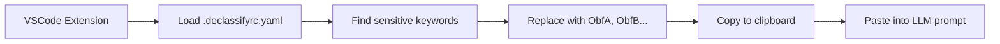

# 🧠 Declassify

Sanitize your source code before sending it to LLMs like ChatGPT. This monorepo contains tools for obfuscating sensitive identifiers (variables, classes, package names) and optionally restoring them later.

LLM에 질문하기 전, 민감한 코드를 자동으로 난독화하고 선택적으로 복원할 수 있도록 돕는 모노레포 프로젝트입니다.

---

## 📁 Packages

| Name | Description |
|------|-------------|
| [`vscode-extension`](./apps/vscode-extension) | VSCode extension for AST-based obfuscation and clipboard integration |
| [`shared-config`](./libs/shared-config)       | Shared logic for reading `.declassifyrc.yaml` config files and defaults |

---

## ⚙️ How It Works



---

## 📦 Installation & Development

### Prerequisites
- [pnpm](https://pnpm.io/)
- [Node.js](https://nodejs.org/) (v18+ recommended)
- [Java](https://adoptopenjdk.net/) (for java-obfuscator v8+ recommended)

### Setup
```bash
git clone https://github.com/swj9707/declassify.git
cd declassify
pnpm install
```

### Build All
```bash
pnpm -r run build
```

### Run VSCode Extension (Development Mode)
1. Open VSCode at `packages/vscode-extension`
2. Press `F5` to launch Extension Development Host
3. Try `Ctrl+Shift+P` → `Declassify: Sanitize Code for LLM`


---

## 🛠 Configuration

`.declassifyrc.yaml` must be placed at your workspace root:

```yaml
keywords:
  - mycorp
  - example
replacements:
  classPrefix: Obf
  packageRoot: com.example
```


---

## 🗺 Roadmap

- [x] Basic keyword-based obfuscation
- [x] Clipboard copy after sanitization
- [x] Shared YAML-based config
- [ ] Restore obfuscated code
- [ ] Kotlin PSI-based obfuscator
- [ ] Web-based config visualizer
- [ ] IntelliJ plugin

---

## 🧾 License

MIT © Woojin Son
